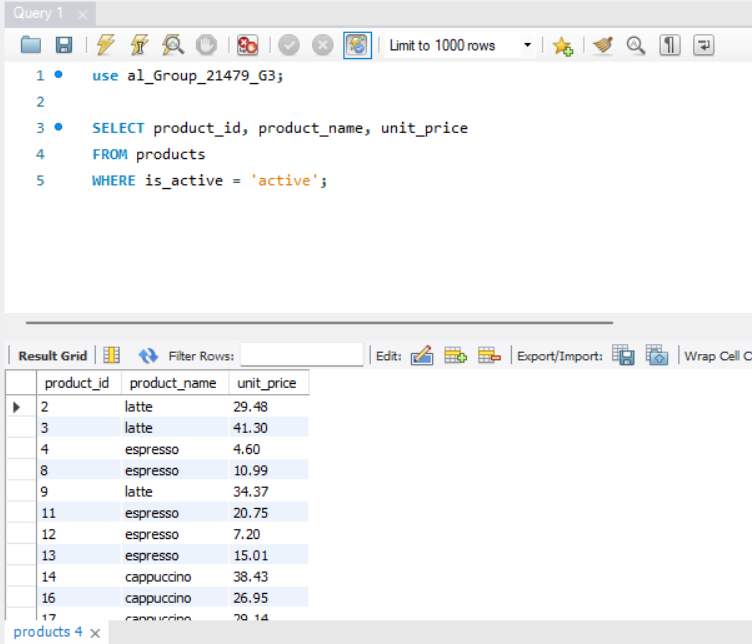
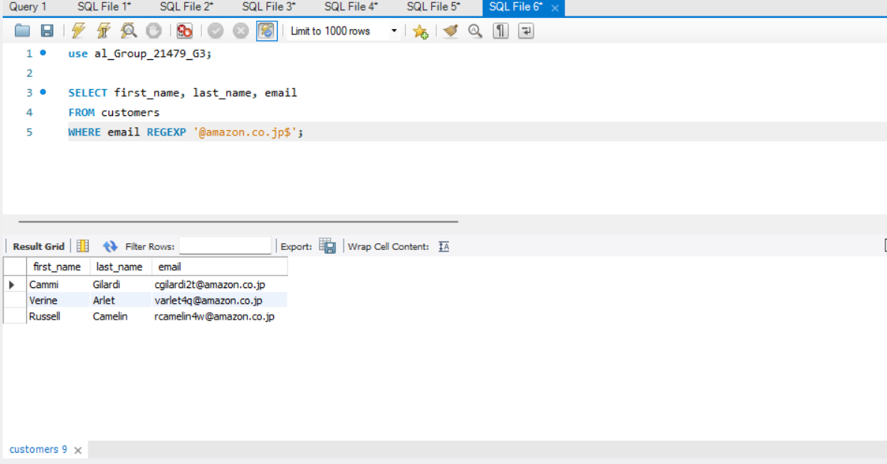
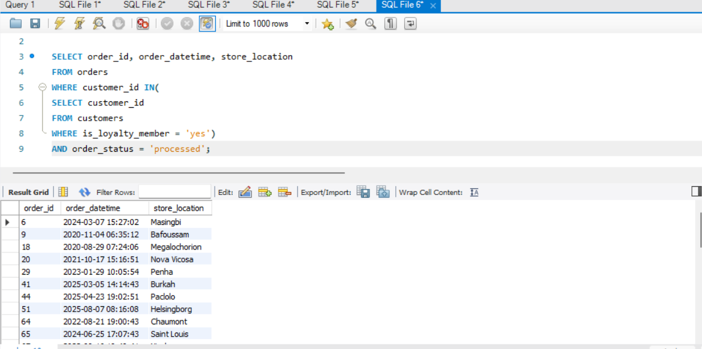
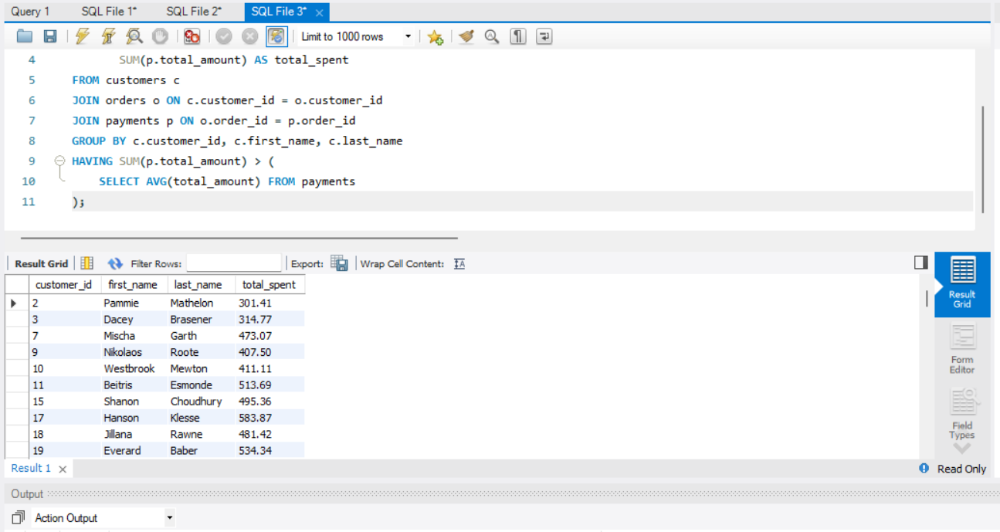
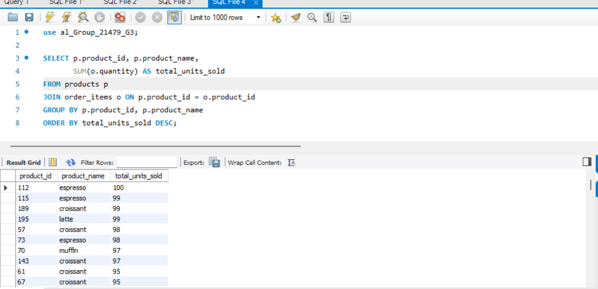
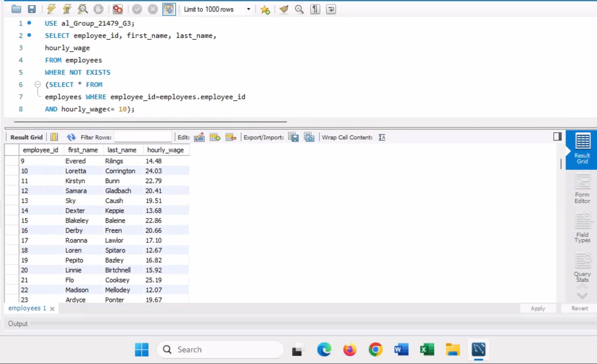
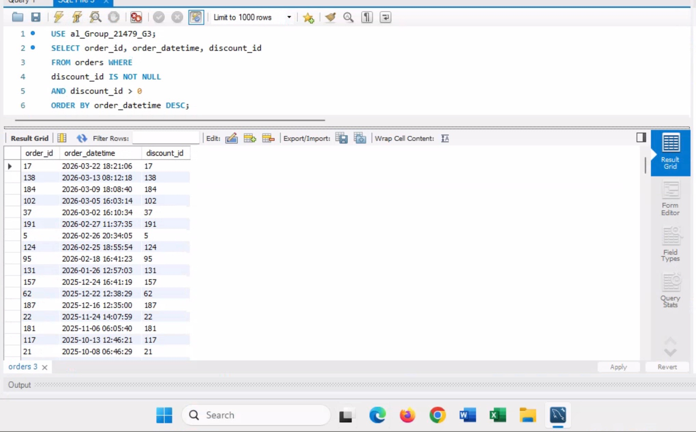
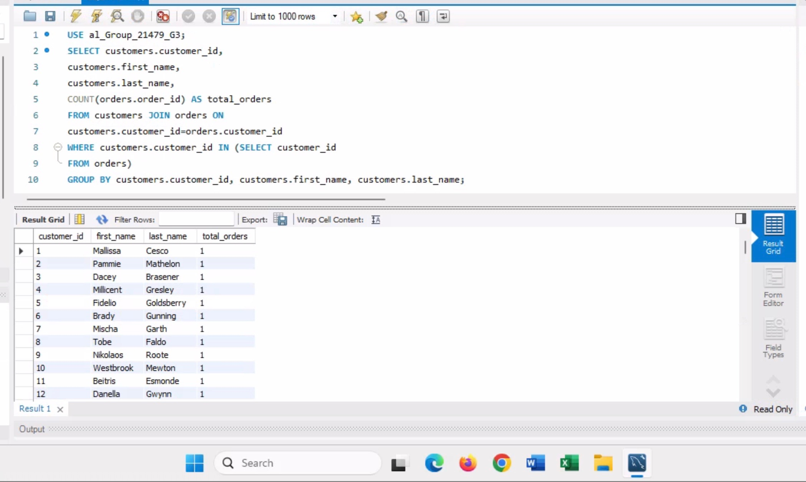
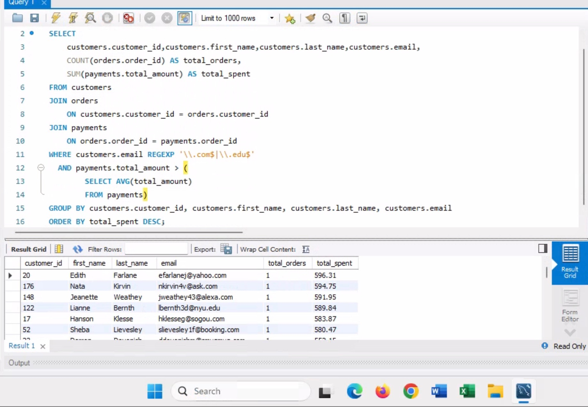
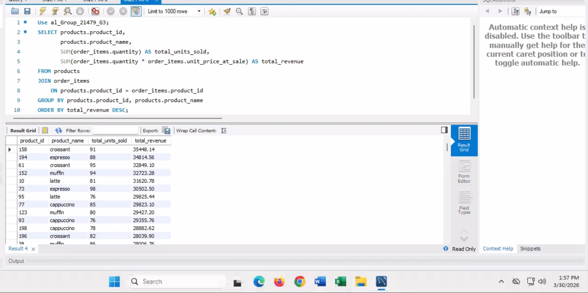

# MIST4610-Group-Project

## Team Name:
21479 Group 3

## Team Members:
1. Isabel Villaca [@icvillaca](https://github.com/icvillaca)
2. Carson Farris [@carsonf17](https://github.com/carsonf17)
3. Phoebe Prescott [@phoebeprescott](https://github.com/phoebeprescott)
4. Alexa Persad [@aepersad](https://github.com/aepersad)

## Problem Description:
Our task was to model and build a relational database for the operations of a coffee shop. The goal of this database is to accurately represent the processes by which a coffee shop handles customer orders, manages products, tracks employees, and records payments in its daily operations. The central entity is Order, which connects to both  customers and employees involved in each transaction. Order is made up of products and order items that define its contents. Payments and discounts that determine its total cost. Employees are tied to the shifts they work, while products are organized by category and are linked to their respective suppliers. We will also perform functioning queries with this data so that they may provide us with valuable business insight about the coffee shop and its operations, such as tracking product sales performance, analyzing customer spending and loyalty, and monitoring employee wages and discount activity. 

## Data Model:
Our model is based on the structure of a basic local coffee shop. This database reflects how the coffee shop operates through each relationship between our multiple entities. Each order is placed by a customer, and has an employee who processes that order. A customer can place many orders while each order is placed by one customer, and each order is handled by one employee even though an employee can process many orders. Both our customer and employees table contains basic information about their name, contact information, etc. The customer entities also include information about our loyalty program, which enables tracking of how often our customers come in and their membership status. Each order may have a discount, which could be a BOGO, price reduction, etc. The orders are linked to payments, which record the subtotal, taxes, tips, and final total charged for that order. This data tracks financial details to determine products. Since an order can contain multiple of our products, and each product can appear in many different orders, we have an order_items table as the associative entity. The product table stores the name, size, price, and availability of our products, with each product belonging to a single category and the categories containing many products. Additionally, each of our products is supplied by our main suppliers, with suppliers being able to provide multiple products. Information about our employees are found through the employees table, which includes their role and wages, and connects their shifts through the shifts table. Overall, this database is designed to track information about the basic everyday operations of a coffee shop through key entities like customers, orders, products, payments, etc.

## Data Dictionary:

## Table: Customers
| Column Name       | Description                                          | Data Type | Size | Format                                                   | Key? |
| :---------------- | :--------------------------------------------------- | :-------- | :--- | :------------------------------------------------------- | :--- |
| customer_id       | PK, unique sequential number                         | INT       |      |                                                          | PK   |
| first_name        | Customer’s first name                                | VARCHAR   | 45   |                                                          |      |
| last_name         | Customer’s last name                                 | VARCHAR   | 45   |                                                          |      |
| email             | Customer’s email address                             | VARCHAR   | 45   | Email format ([blank@blank.com](mailto:blank@blank.com)) |      |
| phone             | Customer’s phone number                              | VARCHAR   | 45   | (###-###-####)                                           |      |
| loyalty_join_date | Date the customer joined the loyalty program         | DATE      |      | YYYY-MM-DD                                               |      |
| is_loyalty_member | Shows whether the customer is in the loyalty program | ENUM      |      | ('yes', 'no')                                            |      |

## Table: Discounts

| Column Name    | Description                                                      | Data Type | Size | Format                 | Key? |
| :------------- | :--------------------------------------------------------------- | :-------- | :--- | :--------------------- | :--- |
| discount_id    | PK, unique sequential number for each discount                   | INT       |      |                        | PK   |
| discount_name  | Name of the discount (holiday, seasonal, student, etc)           | VARCHAR   | 45   |                        |      |
| discount_type  | Type of discount applied (percentage, BOGO, free shipping, etc.) | VARCHAR   | 45   |                        |      |
| discount_value | Value of the discount in decimal format                          | DECIMAL   | 10,2 |                        |      |
| start_date     | Date the discount becomes active                                 | DATE      |      | YYYY-MM-DD             |      |
| end_date       | Date the discount expires                                        | DATE      |      | YYYY-MM-DD             |      |
| is_active      | Shows whether the discount is currently active                   | ENUM      |      | ('active', 'inactive') |      |

## Table: Employees

| Column Name | Description                                                 | Data Type | Size | Format     | Key? |
| :---------- | :---------------------------------------------------------- | :-------- | :--- | :--------- | :--- |
| employee_id | PK, unique sequential number for each employee              | INT       |      |            | PK   |
| first_name  | Employee’s first name                                       | VARCHAR   | 45   |            |      |
| last_name   | Employee’s last name                                        | VARCHAR   | 45   |            |      |
| email       | Employee’s email address                                    | VARCHAR   | 45   |            |      |
| role_title  | Employee's job role (barista, supervisor, cashier, manager) | VARCHAR   | 45   |            |      |
| hire_date   | Date the employee was hired                                 | DATE      |      | YYYY-MM-DD |      |
| hourly_wage | Employee's hourly pay rate                                  | DECIMAL   | 6,2  |            |      |

## Table: Order\_Items

| Column Name        | Description                                            | Data Type | Size | Format | Key?        |
| :----------------- | :----------------------------------------------------- | :-------- | :--- | :----- | :---------- |
| order_item_id      | PK, unique identifier for each item in an order        | INT       |      |        | PK          |
| quantity           | Number of units of the product in this order line      | INT       |      |        |             |
| unit_price_at_sale | Price of one unit at time of sale                      | DECIMAL   | 10,2 |        |             |
| line_notes         | Additional notes for this order (special instructions) | VARCHAR   | 45   |        |             |
| order_id           | Identifier of which order this item belongs to         | INT       |      |        | FK orders   |
| product_id         | Identifier of the product being ordered                | INT       |      |        | FK products |

## Table: Orders

| Column Name    | Description                                                  | Data Type | Size | Format              | Key?         |
| :------------- | :----------------------------------------------------------- | :-------- | :--- | :------------------ | :----------- |
| order_id       | PK, unique sequential number                                 | INT       |      |                     | PK           |
| order_datetime | Date and time when the order was placed                      | DATETIME  |      | YYYY-MM-DD HH:MM:SS |              |
| order_status   | Current status of the order (processed, pending, incomplete) | VARCHAR   | 45   |                     |              |
| employee_id    | Employee who processed the order                             | INT       |      |                     | FK employees |
| customer_id    | Customer who placed the order                                | INT       |      |                     | FK customers |
| discount_id    | Discount applied to the order (if any)                       | INT       |      |                     | FK discounts |

## Table: Payments

| Column Name     | Description                                               | Data Type | Size | Format | Key?      |
| :-------------- | :-------------------------------------------------------- | :-------- | :--- | :----- | :-------- |
| payment_id      | PK, unique sequential number for each payment transaction | INT       |      |        | PK        |
| payment_method  | Method used to pay for order (card, cash, etc.)           | VARCHAR   | 45   |        |           |
| subtotal        | Total cost before discounts and tax                       | DECIMAL   | 10,2 |        |           |
| discount_amount | Amount deducted using discounts                           | DECIMAL   | 10,2 |        |           |
| tax_amount      | Sales tax amount                                          | DECIMAL   | 10,2 |        |           |
| total_amount    | Final amount charged                                      | DECIMAL   | 10,2 |        |           |
| tip_amount      | Tip amount added by customer                              | DECIMAL   | 10,2 |        |           |
| order_id        | Identifier of associated order                            | INT       |      |        | FK orders |

## Table: Product\_Categories

| Column Name   | Description                  | Data Type | Size | Format | Key? |
| :------------ | :--------------------------- | :-------- | :--- | :----- | :--- |
| category_id   | PK, unique sequential number | INT       |      |        | PK   |
| category_name | Name of the product category | VARCHAR   | 45   |        |      |

## Table: Products

| Column Name  | Description                                      | Data Type | Size | Format       | Key?                  |
| :----------- | :----------------------------------------------- | :-------- | :--- | :----------- | :-------------------- |
| product_id   | PK, unique sequential number                     | INT       |      |              | PK                    |
| product_name | Name of the product                              | VARCHAR   | 45   |              |                       |
| size_label   | Size of the product (small, medium, large)       | VARCHAR   | 45   |              |                       |
| unit_price   | Price per unit of the product                    | DECIMAL   | 10,2 |              |                       |
| is_active    | Shows whether the product is currently available | ENUM      |      | ('yes','no') |                       |
| category_id  | Identifier of the product category               | INT       |      |              | FK product_categories |
| supplier_id  | Identifier of the supplier                       | INT       |      |              | FK suppliers          |

## Table: Shifts

| Column Name | Description                            | Data Type | Size | Format              | Key?         |
| :---------- | :------------------------------------- | :-------- | :--- | :------------------ | :----------- |
| shift_id    | PK, unique sequential number for shift | INT       |      |                     | PK           |
| shift_start | Start date and time of the shift       | DATETIME  |      | YYYY-MM-DD HH:MM:SS |              |
| shift_end   | End date and time of the shift         | DATETIME  |      | YYYY-MM-DD HH:MM:SS |              |
| station     | Work station used (BAR, REG, KTC)      | VARCHAR   | 45   |                     |              |
| employee_id | Identifier of assigned employee        | INT       |      |                     | FK employees |

## Table: Suppliers

| Column Name   | Description                                 | Data Type | Size | Format         | Key? |
| :------------ | :------------------------------------------ | :-------- | :--- | :------------- | :--- |
| supplier_id   | PK, unique sequential number for a supplier | INT       |      |                | PK   |
| supplier_name | Name of the supplier company                | VARCHAR   | 45   |                |      |
| contact_name  | Main contact person                         | VARCHAR   | 45   |                |      |
| phone         | Supplier phone number                       | VARCHAR   | 45   | (###-###-####) |      |
| email         | Supplier email address                      | VARCHAR   | 45   | Email format   |      |

## Queries:
## Query 1 
Query 1 lists the product name, ID, and unit price for all active products in the database, filtering using the “is\_active” attribute. 

This would provide a very basic and up-to-date understanding for managers to know what is currently sellable. This can be useful for things like inventory checks, catalog updates, and removing discontinued or irrelevant items. This can help to avoid confusion and prevent outdated items that aren’t needed from appearing in the catalog. 

## Query 2
Query 2 retrieves the customers who have email address from Amazon, or ending in “@amazon.co.jp”. 

This pattern-based query could be useful for identifying certain customer segments based on certain emails, potentially for new marketing campaigns or trends based on their email. For example, the company might want to analyze engagement between those using amazon vs those using yahoo. It works give the business more overall information on their customers to help them better penetrate the market. 

## Query 3
Query 3 lists all the processed orders that were placed by customers who are part of the loyalty program. 

This query can be used to evaluate the behavior of loyalty program members, more specifically, the completed purchases. This query can help managers evaluate the success of the loyalty program, by seeing if it is actually working at driving sales and identifying the highest value customer segments. 

## Query 4
Query 4 calculates the total amount spent by each customer by joining the customers, orders, and payments tables, and then conducting the comparison using a subquery to calculate the overall average. 

This complex query is very useful for identifying high-value customers whose spending is over the average amount, helping the business to better segment its customer base. Furthermore, this data could be used for targeted marketing and loyalty programs. Overall, through its multiple joins, it provides a much more complete view of customer spending behavior, helping the business to make more well-informed decisions on how to move forward. 

## Query 5
Query 5 identifies the most popular products in terms of units sold for each product. The results are grouped by product and sorted in descending order.

Query 5 is useful for businesses to see which products are selling the best, helping them to grasp both market demand and consumer preferences. This would then inform all kinds of other business decisions, like inventory management and marketing strategies. 

## Query 6
Query 6 lists all employees who are making more than 10 dollars an hour.   

Query 6 allows management to identify employees that are making above a certain wage threshold, $10/hr. Managers are able to use the information for budgeting and ensure fair wages. Managers can also use the information to see whether a specific hourly wage someone is earning aligns with their performance and role.

## Query 7
Query 7 lists all orders in which a discount was applied. It also lists the dates and times it occurred in descending order.  

Query 7 allows shops and managers to see how often and how many orders are used with a discount. This is useful to track revenue and profitability with different promotions done for customers. This query can also be used to track employee behavior and ensure discounts are being applied in accordance to company policy.

## Query 8
Query 8 lists the names and IDs of customers and how many orders they have placed.  

Query 8 is valuable to managers that are trying to view the history of customer behavior. It also allows shops to see the degree of loyalty customers show and how well shops can retain customers. This can be used to show customers who are not as active but could possibly re-engage through promotional efforts and marketing.

## Query 9
Query 9 lists customers with emails that end in .com and .edu. It also combines customers, orders, and payments to show only customers with payments greater than the average payment amount in descending order.  

Query 9 helps identify customers who spend more than the average and narrows this list by only coming customers who have emails that end in .com and .edu. This allows managers to distinguish valuable customers who are more important to the business that could benefit from promotions while giving insight on loyalty.

## Query 10
Query 10 lists every product and corresponding ID. It also lists how many units of each are sold and is presented in descending order of total revenue for each product.  

Query 10 allows managers to view which products are the most profitable. This allows shops to tailor their menus and offer more products that managers think would sell by looking at this query. This query also allows for shops to understand their supply management and which products may need to be restocked more often.

| Feature | Query 1 | Query 2 | Query 3 | Query 4 | Query 5 | Query 6 | Query 7 | Query 8 | Query 9 | Query 10 |
| :---- | :---- | :---- | :---- | :---- | :---- | :---- | :---- | :---- | :---- | :---- |
| Multiple table join |  |  |  | X | X |  |  |  | X |  |
| subquery |  |  |  | X |  | X |  | X | X |  |
| Group By |  |  |  |  | X |  |  | X | X | X |
| Group By with Having |  |  |  | X |  |  |  |  |  |  |
| Multi condition where |  | X |  |  |  |  | X |  |  |  |
| Built-in functions |  |  |  | X | X |  |  | X | X | X |
| **REGEXPS** |  | X |  |  |  |  |  |  | X |  |
| **NOT EXISTS** |  |  |  |  |  | X |  |  |  |  |

## Database Information:
Name of the database: al_Group_21479_G3

Additional information: Each query listed above is marked in the database using stored procedures which can be called using the following format: CALL TP_Q3();

