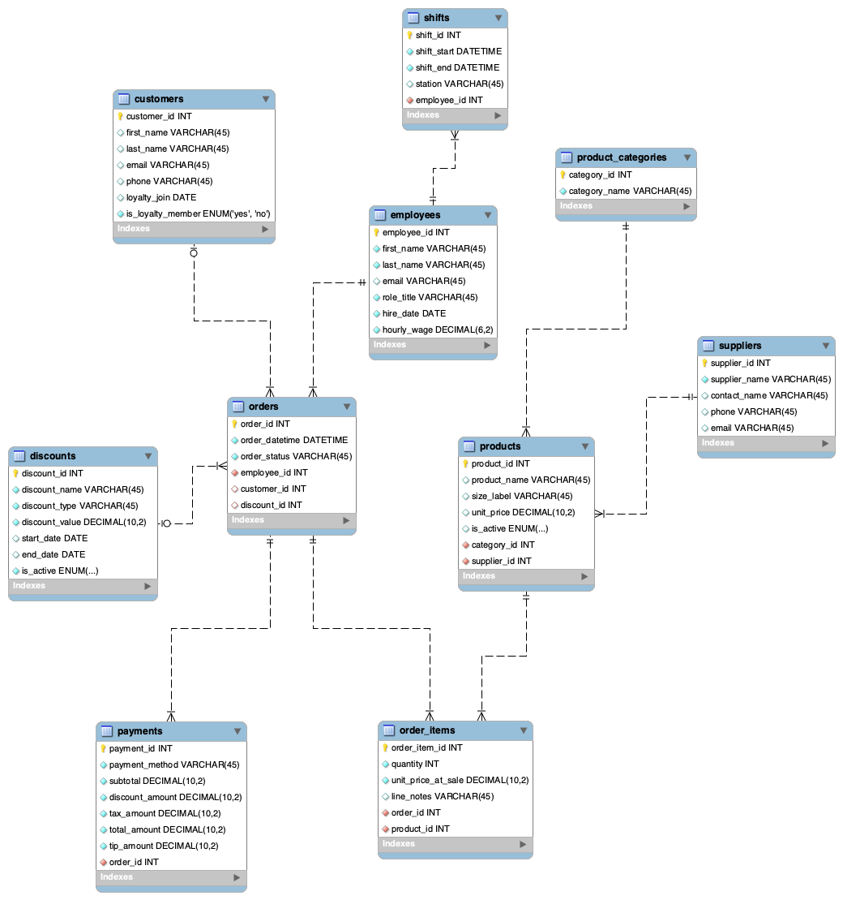

# MIST4610-Group-Project
## Team Name:
21479 Group 3

## Team Members:
1. Isabel Villaca [@icvillaca](https://github.com/icvillaca)
2. Carson Farris [@carsonf17](https://github.com/carsonf17)
3. Phoebe Prescott [@phoebeprescott](https://github.com/phoebeprescott)
4. Alexa Persad [@aepersad](https://github.com/aepersad)

## Problem Description:
Our task was to model and build a relational database for the operations of a coffee shop. The goal of this database is to accurately represent the processes by which a coffee shop handles customer orders, manages products, tracks employees, and records payments in its daily operations. The central entity is Order, which connects to both  customers and employees involved in each transaction. Order is made up of products and order items that define its contents. Payments and discounts that determine its total cost. Employees are tied to the shifts they work, while products are organized by category and are linked to their respective suppliers. We will also perform functioning queries with this data so that they may provide us with valuable business insight about the coffee shop and its operations, such as tracking product sales performance, analyzing customer spending and loyalty, and monitoring employee wages and discount activity. 

## Data Model
Our model is based on the structure of a basic local coffee shop. This database reflects how the coffee shop operates through each relationship between our multiple entities. Each order is placed by a customer, and has an employee who processes that order. A customer can place many orders while each order is placed by one customer, and each order is handled by one employee even though an employee can process many orders. Both our customer and employees table contains basic information about their name, contact information, etc. The customer entities also include information about our loyalty program, which enables tracking of how often our customers come in and their membership status. Each order may have a discount, which could be a BOGO, price reduction, etc. The orders are linked to payments, which record the subtotal, taxes, tips, and final total charged for that order. This data tracks financial details to determine products. Since an order can contain multiple of our products, and each product can appear in many different orders, we have an order_items table as the associative entity. The product table stores the name, size, price, and availability of our products, with each product belonging to a single category and the categories containing many products. Additionally, each of our products is supplied by our main suppliers, with suppliers being able to provide multiple products. Information about our employees are found through the employees table, which includes their role and wages, and connects their shifts through the shifts table. Overall, this database is designed to track information about the basic everyday operations of a coffee shop through key entities like customers, orders, products, payments, etc.

## Data Dictionary

## Table: Customers
| Column Name       | Description                                          | Data Type | Size | Format                                                   | Key? |
| :---------------- | :--------------------------------------------------- | :-------- | :--- | :------------------------------------------------------- | :--- |
| customer_id       | PK, unique sequential number                         | INT       |      |                                                          | PK   |
| first_name        | Customer’s first name                                | VARCHAR   | 45   |                                                          |      |
| last_name         | Customer’s last name                                 | VARCHAR   | 45   |                                                          |      |
| email             | Customer’s email address                             | VARCHAR   | 45   | Email format ([blank@blank.com](mailto:blank@blank.com)) |      |
| phone             | Customer’s phone number                              | VARCHAR   | 45   | (###-###-####)                                           |      |
| loyalty_join_date | Date the customer joined the loyalty program         | DATE      |      | YYYY-MM-DD                                               |      |
| is_loyalty_member | Shows whether the customer is in the loyalty program | ENUM      |      | ('yes', 'no')                                            |      |

## Table: Discounts

| Column Name    | Description                                                      | Data Type | Size | Format                 | Key? |
| :------------- | :--------------------------------------------------------------- | :-------- | :--- | :--------------------- | :--- |
| discount_id    | PK, unique sequential number for each discount                   | INT       |      |                        | PK   |
| discount_name  | Name of the discount (holiday, seasonal, student, etc)           | VARCHAR   | 45   |                        |      |
| discount_type  | Type of discount applied (percentage, BOGO, free shipping, etc.) | VARCHAR   | 45   |                        |      |
| discount_value | Value of the discount in decimal format                          | DECIMAL   | 10,2 |                        |      |
| start_date     | Date the discount becomes active                                 | DATE      |      | YYYY-MM-DD             |      |
| end_date       | Date the discount expires                                        | DATE      |      | YYYY-MM-DD             |      |
| is_active      | Shows whether the discount is currently active                   | ENUM      |      | ('active', 'inactive') |      |

## Table: Employees

| Column Name | Description                                                 | Data Type | Size | Format     | Key? |
| :---------- | :---------------------------------------------------------- | :-------- | :--- | :--------- | :--- |
| employee_id | PK, unique sequential number for each employee              | INT       |      |            | PK   |
| first_name  | Employee’s first name                                       | VARCHAR   | 45   |            |      |
| last_name   | Employee’s last name                                        | VARCHAR   | 45   |            |      |
| email       | Employee’s email address                                    | VARCHAR   | 45   |            |      |
| role_title  | Employee's job role (barista, supervisor, cashier, manager) | VARCHAR   | 45   |            |      |
| hire_date   | Date the employee was hired                                 | DATE      |      | YYYY-MM-DD |      |
| hourly_wage | Employee's hourly pay rate                                  | DECIMAL   | 6,2  |            |      |

## Table: Order\_Items

| Column Name        | Description                                            | Data Type | Size | Format | Key?        |
| :----------------- | :----------------------------------------------------- | :-------- | :--- | :----- | :---------- |
| order_item_id      | PK, unique identifier for each item in an order        | INT       |      |        | PK          |
| quantity           | Number of units of the product in this order line      | INT       |      |        |             |
| unit_price_at_sale | Price of one unit at time of sale                      | DECIMAL   | 10,2 |        |             |
| line_notes         | Additional notes for this order (special instructions) | VARCHAR   | 45   |        |             |
| order_id           | Identifier of which order this item belongs to         | INT       |      |        | FK orders   |
| product_id         | Identifier of the product being ordered                | INT       |      |        | FK products |

## Table: Orders

| Column Name    | Description                                                  | Data Type | Size | Format              | Key?         |
| :------------- | :----------------------------------------------------------- | :-------- | :--- | :------------------ | :----------- |
| order_id       | PK, unique sequential number                                 | INT       |      |                     | PK           |
| order_datetime | Date and time when the order was placed                      | DATETIME  |      | YYYY-MM-DD HH:MM:SS |              |
| order_status   | Current status of the order (processed, pending, incomplete) | VARCHAR   | 45   |                     |              |
| employee_id    | Employee who processed the order                             | INT       |      |                     | FK employees |
| customer_id    | Customer who placed the order                                | INT       |      |                     | FK customers |
| discount_id    | Discount applied to the order (if any)                       | INT       |      |                     | FK discounts |

## Table: Payments

| Column Name     | Description                                               | Data Type | Size | Format | Key?      |
| :-------------- | :-------------------------------------------------------- | :-------- | :--- | :----- | :-------- |
| payment_id      | PK, unique sequential number for each payment transaction | INT       |      |        | PK        |
| payment_method  | Method used to pay for order (card, cash, etc.)           | VARCHAR   | 45   |        |           |
| subtotal        | Total cost before discounts and tax                       | DECIMAL   | 10,2 |        |           |
| discount_amount | Amount deducted using discounts                           | DECIMAL   | 10,2 |        |           |
| tax_amount      | Sales tax amount                                          | DECIMAL   | 10,2 |        |           |
| total_amount    | Final amount charged                                      | DECIMAL   | 10,2 |        |           |
| tip_amount      | Tip amount added by customer                              | DECIMAL   | 10,2 |        |           |
| order_id        | Identifier of associated order                            | INT       |      |        | FK orders |

## Table: Product\_Categories

| Column Name   | Description                  | Data Type | Size | Format | Key? |
| :------------ | :--------------------------- | :-------- | :--- | :----- | :--- |
| category_id   | PK, unique sequential number | INT       |      |        | PK   |
| category_name | Name of the product category | VARCHAR   | 45   |        |      |

## Table: Products

| Column Name  | Description                                      | Data Type | Size | Format       | Key?                  |
| :----------- | :----------------------------------------------- | :-------- | :--- | :----------- | :-------------------- |
| product_id   | PK, unique sequential number                     | INT       |      |              | PK                    |
| product_name | Name of the product                              | VARCHAR   | 45   |              |                       |
| size_label   | Size of the product (small, medium, large)       | VARCHAR   | 45   |              |                       |
| unit_price   | Price per unit of the product                    | DECIMAL   | 10,2 |              |                       |
| is_active    | Shows whether the product is currently available | ENUM      |      | ('yes','no') |                       |
| category_id  | Identifier of the product category               | INT       |      |              | FK product_categories |
| supplier_id  | Identifier of the supplier                       | INT       |      |              | FK suppliers          |

## Table: Shifts

| Column Name | Description                            | Data Type | Size | Format              | Key?         |
| :---------- | :------------------------------------- | :-------- | :--- | :------------------ | :----------- |
| shift_id    | PK, unique sequential number for shift | INT       |      |                     | PK           |
| shift_start | Start date and time of the shift       | DATETIME  |      | YYYY-MM-DD HH:MM:SS |              |
| shift_end   | End date and time of the shift         | DATETIME  |      | YYYY-MM-DD HH:MM:SS |              |
| station     | Work station used (BAR, REG, KTC)      | VARCHAR   | 45   |                     |              |
| employee_id | Identifier of assigned employee        | INT       |      |                     | FK employees |

## Table: Suppliers

| Column Name   | Description                                 | Data Type | Size | Format         | Key? |
| :------------ | :------------------------------------------ | :-------- | :--- | :------------- | :--- |
| supplier_id   | PK, unique sequential number for a supplier | INT       |      |                | PK   |
| supplier_name | Name of the supplier company                | VARCHAR   | 45   |                |      |
| contact_name  | Main contact person                         | VARCHAR   | 45   |                |      |
| phone         | Supplier phone number                       | VARCHAR   | 45   | (###-###-####) |      |
| email         | Supplier email address                      | VARCHAR   | 45   | Email format   |      |

## Queries

